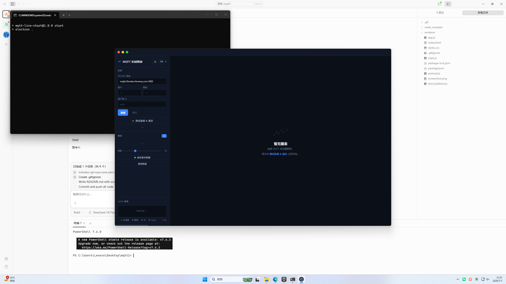

# MQTT Charts

实时 MQTT JSON 数据可视化仪表盘 — 基于 Electron + Chart.js 的桌面图表工具。

Real-time MQTT JSON data visualization dashboard — a desktop charting tool built with Electron + Chart.js.



## Features

- **MQTT 连接** — 支持用户名/密码认证，可自定义 Client ID
- **实时图表** — 自动多线模式（所有数字字段）或自定义 JS 表达式
- **BI 看板模式** — 点击卡片最大化，展示 KPI、大图、明细表
- **内存安全** — 对象池复用数据点、消息批处理、时间范围自动裁剪
- **暗色主题** — #111827 色系，圆角面板，Recordly 风格
- **i18n 中英文** — 一键切换语言
- **响应式布局** — 侧边栏可折叠、面板可拖拽调整高度、图表可拖拽排序
- **交互式字段管理** — 选中图表后通过字段工具栏切换显示/隐藏，JSON 预览区支持快速添加
- **导出 CSV** — BI 视图中一键导出时序数据
- **持久化** — 图表配置、面板布局、Broker 地址自动保存到 localStorage

## Quick Start

```bash
# 安装依赖
npm install

# 启动（Electron 开发模式）
npm start

# 打包 Windows exe
npm run build
```

## Usage

1. 启动后点击 **⚡ Test Connection & Demo** 一键连接公共 Broker + 启动演示数据
2. 或手动填入 Broker 地址，点击 **Connect**
3. 点击 **+** 添加图表，选择 MQTT Topic
4. 图表支持 **Auto Multi-Line**（显示所有数字字段）和 **Custom Expression** 模式
5. 点击图表卡片选中，通过底部字段栏切换线条显示
6. 双击标题可重命名，拖拽排序
7. 点击 **⛶** 进入 BI 看板模式

## Keyboard Shortcuts

| Shortcut | Action |
|----------|--------|
| `Ctrl+N` | 新建图表 |
| `Ctrl+W` | 删除选中图表 |
| `Space` | 暂停/继续选中图表 |
| `Esc` | 关闭模态框 / BI 看板 |

## Tech Stack

- **Electron 33** — 跨平台桌面框架
- **Chart.js 4.4** — 图表渲染（bezier 曲线、渐变填充、时间轴）
- **MQTT.js 5** — MQTT 客户端
- **electron-builder 25** — Windows 打包

## Project Structure

```
mqtt1/
├── main.js              # Electron 主进程 + MQTT 客户端 + 演示发布器
├── preload.js           # IPC 桥接
├── renderer/
│   ├── index.html       # UI 结构
│   ├── styles.css       # 暗色主题样式
│   └── app.js           # 全部应用逻辑
├── test-publisher.js    # 外部测试发布脚本
└── package.json
```

## License

MIT
